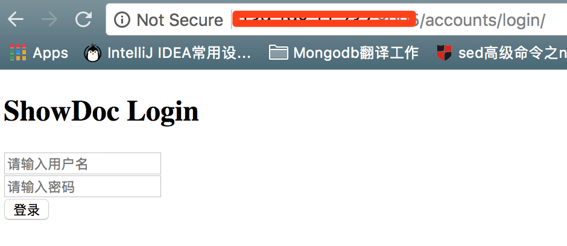
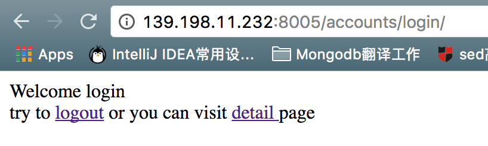
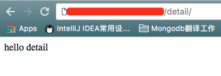
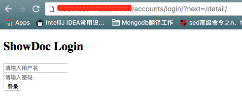

## Abstract

	django认证系统测试
	+ 页面有无权限访问通过 @login_required 控制
	+ 实现登录、退出功能
	+ 登录通过才可以访问 @login_required 控制的页面。
	+ 如果登录就访问 @login_required 控制的页面 就跳转到登录页面要求登录。

## 测试截图展示

未登录访问首页跳转到登录页面
或者访问登录页面

登录成功跳转到首页

登录成功的状态下访问详情页面

退出未登录状态下访问详情页会跳转到登录页

